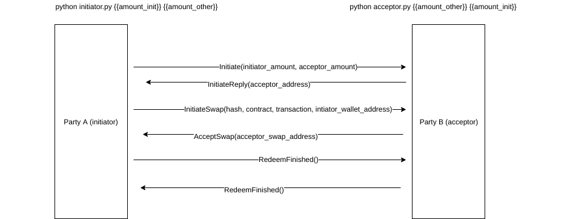
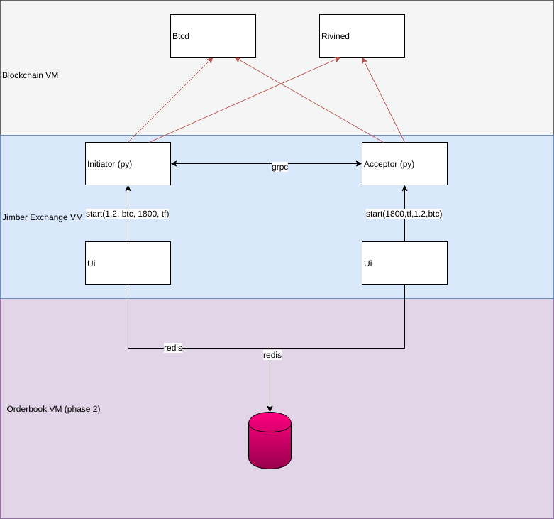

# AtomicExchange
POC for Atomic cryptocurreny exchange based on atomic swaps

[Development for version 1.0 has started!!](https://github.com/rivine/AtomicExchange/blob/master/AtomicExchange.Docs/ArchitectureVersion1.md)

## Scope
For the first POC the scope is swapping bitcoins (initiator) for TfChain/Rivine (acceptor) tokens.
## Scripts
Two scripts are created. The initator and acceptor scripts. They are essentially a TCP client and server using gRpc to communicate. Both of the parties will use Zerotier for easy, NAT friendly communication.

## Flow
The flow is based on this [readme](https://github.com/rivine/rivine/blob/master/doc/atomicswap/atomicswap.md) and the same binaries are used from within the Python script. The binaries are adjusted so the output is JSON instead of plain text.

Flow overview:



This is a simplified flow since Blockchain technology needs time to get the nodes into sync. It will be required to poll the Blockchain (or get an event) to continue the flow when the required data is available.

## Architecture 



Two environments will be needed. One will contain full blockchain nodes (or the least implementation needed for a simple wallet). Another one will contain the command line tools (bitcoin-cli / rivinec) to communicate with the nodes and all the required scripts and Ui implementation. In a later phase an orderbook will be added and we will use distributed lightweight wallets.


## Docker
In a first phase a Dockerfile was created using to install both the bitcoind and tfchain binaries/daemons. The Docker has both scripts at disposal and can be used to easily initiate a swap.

The docker has to be started with these arguments so Zerotier works:
--device=/dev/net/tun --cap-add=NET_ADMIN
```
docker pull jimber/atomicexchange
docker run --device=/dev/net/tun --cap-add=NET_ADMIN --cap-add=SYS_ADMIN -d --name crypto1  -v /crypto/crypto1:/crypto -e QT_WEBGL_WEBSOCKETSERVER=ws://0.0.0.0:33000 jimber/atomicexchange
```
## Todo
* ~~Create pseudo code for flow~~
* ~~Create Dockerfile with bitcoin binaries~~
* ~~Adjust Dockerfile for tfChain binaries~~
* ~~Create Python script using gRpc based on pseudo code~~
* ~~Prepare environments for first swap (get tokens)~~
* ~~Adjust btcatomic swap binaries for json output~~
* ~~Adjust rivine/tfchain binaries for json output~~
* ~~Do manual swap~~
* ~~Adjust .md file to match output~~
* ~~Add timers/checks in script where it is required~~
* ~~Do automatic swap~~
* Finetuning of script
* ~~Add Zerotier to docker so swap is possible in different networks~~

## Links
[atomic swap documentation](https://github.com/rivine/rivine/blob/master/doc/atomicswap/atomicswap.md)
[Rivine repositories](https://github.com/rivine/rivine)
